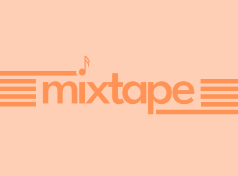

# Mixtape
### A music-based journaling app 🎸

Mixtape is a music-based journaling app for journalists, music-junkies, and musicians alike that allows users to create "mixtapes" - specialized playlists where users can find space to reflect on their own lived experiences.

With mixtapes, users can wield music as a tool to reflect on and journal about significant life events or important moments that are bigger than a singular journal entry or span a longer period of time. Users can add songs that represent important moments and reflect on each track, by captioning individual songs to describe their significance or reflect on their meaning. Mixtapes can be private or collaborative, and are shareable among users and friends.

Additionally, Mixtape also allows users to create more typical journal entries. With these entries, users can add standard media such as photos or music, and write or reflect about whatever they need. Users may be inspired by a particular song lyric or moment from their day which would make a journal entry the perfect space for a small moment of reflection.

# Status Update: Preparing for beta 🚀

I am wrapping up the initial development of this app! Beta testing will begin soon – if you'd like to be a beta tester, feel free to reach out to me at olinlj@icloud.com

# Feedback + Suggestions

I would absolutely love to hear any and all feedback - it can be a feature suggestion, design idea, bug, or anything else that would help improve the app (feedback is greatly appreciated). I'll be publishing a feedback form soon.

# Contributing

If you're a designer or developer wanting to lend a hand, I'd love to see contributions. Open an issue or PR, or reach out to me at olinlj@icloud.com.

